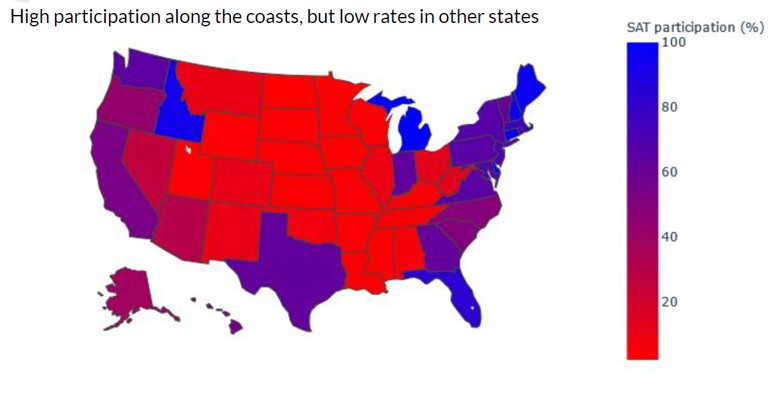

# General Assembly Project 1: SAT vs ACT

### Overview

My first project in General Assembly Data Science Immersion to work on a set of data on US standard examinations (SAT and ACT). The primary objective is to present new ideas to the executives of College Board, the organisation that administers SAT):

Based on the given data and external research, I am tasked to make recommendations about how the College Board might work to increase the participation rate in a state chosen by me.

---

### Datasets

#### Provided Data
Two datasets were given as the basis:
- 2017 and 2018 SAT Scores
- 2017 and 2018 ACT Scores

#### In addition, I sourced from public sources the below datasets:
- Estimated Population 2017
- Median Household Income 2017

---

### Problem Statement
Identify a state for College Board to focus on improving participation rate, based on internal and external data

---

### Data Import and Cleaning
The given datasets for 2017 and 2018 were largely clean. Standard cleaning includes
- tidying up column names ie changing strings to lower cases, and removing spaces
- converting the numbers in strings to float
- removing the row of national average (ACT data)
- rectifying an erroneous number (Maryland, Math, SAT 2017)
- merging the datasets of both exams in 2017 and 2018

---

### Exploratory Data Analysis
Using the function "describe" and sort by values in various fields to get a sense of data
- One initial finding eg states with lowest SAT participation rate have highest ACT participation rate, and vice versa

---

### Data Visualization
#### Output - Participation Rate
- Participation rate (by state) is the only output of the analysis, so the first few steps is to understand this field
- Standard steps are taken eg histogram of participation rates, SAT vs ACT comparison, year on year changes
- In most states, participation rates are geared towards 0 or 100%
- Possible explanation based on public sources: contracts between states with SAT/ACT to provide the one of the tests to students; majority of students take one test only
- Used the library Plotly to do a choropleth map - SAT is dominant in coastal areas

Figure 1: SAT participation by State

#### Other Fields
- Another important fields, among others, are students overall scores, ie SAT Total or ACT Composite
- When analysing the distribution of SAT Total / ACT Composite, two normal distributions are noticed
- Scatter plot of scores vs participation rates show that there seem to be two subsets of data due to higher and lower participation. The same patterns are seen across SAT/ACT, overall scores and subject scores, in 2017 and 2018
- One interesting relationship is found - overall scores vs participation rate - a strong negative correlation ie lower overall scores for higher participation rates
- Possible explanation based on public sources: only stronger students will take an additional test on top of the requirement/provision by the state

---

### Descriptive and inferential Statistics
Potentially more inferential statistical analysis could be done with a larger dataset of the same nature.
For this project, there are only 51 data points in each field, and it seems that there are two subsets (by low/high participation rates), so no further inferential statistical analysis was conducted

---

### Outside Research
#### Demographic data
Demographic data is important to business decision making, hence two new datasets were sourced:
- Population by state
- Median household income by state

---

### Conclusions and Recommendations
#### Florida - the state of choice
Reasons are:
- Significant drop in SAT participation to recover
- Room to improve overall scores eg via pre-testing support
- It is one of the most populous states (top 3)

